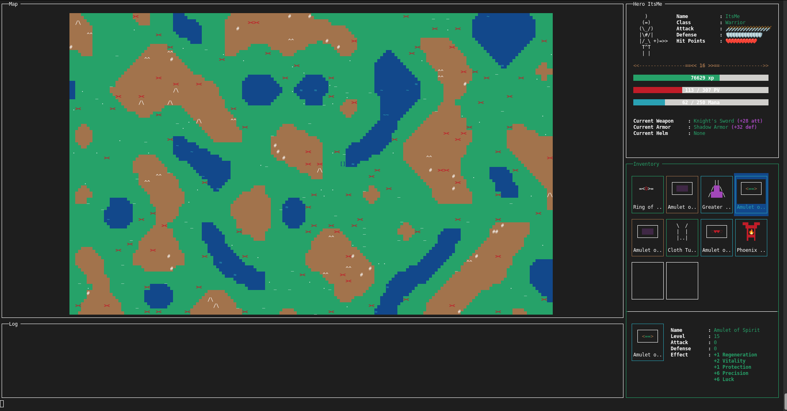

# Swingy - README

Bienvenue dans **Swingy**, un projet Java offrant deux interfaces de jeu : **Console** et **Graphique (GUI)**.  
La version **Console** est la plus aboutie à ce stade, mais vous pouvez choisir à votre convenance.

---


## Compilation et exécution

### 1. Compilation

Le projet utilise **Maven** pour la compilation et la gestion des dépendances.  
Pour compiler et générer un JAR exécutable, exécutez :

```bash
mvn clean package
```

### 2. Lancement de la bdd


```bash
cd mysql
./run.sh start
```


### 3. Exécution

Une fois la compilation terminée, le JAR exécutable sera disponible (par exemple dans le dossier `target/`).  
Vous pouvez alors lancer le jeu de la manière suivante :

```bash
java -jar swingy.jar <gui|console>
```

- **gui** : lance la version graphique (Swing)
- **console** : lance la version console (plus avancée fonctionnellement)

---

## Commandes et raccourcis

### Mode Console

- **Flèches directionnelles** : se déplacer sur la carte
- **Tab** : changer de fenêtre (si plusieurs fenêtres sont actives)
- **Agrandir le terminal** : la console nécessite un terminal suffisamment grand.  
  Si nécessaire, **réduisez la taille des caractères** pour plus de lisibilité.

### Mode GUI

- **Focus sur la map** : cliquez sur la fenêtre de la carte pour activer les raccourcis.
- **Flèches directionnelles** : se déplacer sur la carte (en mode GUI)
- **Touche `c`** : passer en mode console (si disponible)

---

## Explication rapide du jeu

- **Objectif** : quitter la carte en atteignant ses bords.
- **Monstres** : en les affrontant, vous gagnez des items qui augmentent vos statistiques.
  - Les monstres des **montagnes** sont plus forts.
  - Les monstres **ne peuvent pas** changer de zone (plaines / montagnes).
- **Items** : armures, casques et armes s’équipent et améliorent vos stats.  
  Les **bracelets** et **anneaux** ont un effet permanent tant qu’ils sont présents dans votre inventaire.
- **Fuir un combat** : vous avez 1 chance sur 2 de réussir à fuir.
- **Base de données** : toutes les données sont enregistrées dans une base MySQL (détails ci-dessous).

---

## Base de données : MySQL via Docker

Le jeu nécessite une base de données **MySQL** pour fonctionner.  
Dans le dossier `mysql`, vous trouverez un script `run.sh` permettant de gérer un conteneur Docker MySQL de manière simple.

### 1. Fichier `.env`

Avant toute chose, vous devez créer (ou compléter) un fichier `.env` à la racine du projet avec vos variables d’environnement, par exemple :

```
MYSQL_ROOT_PASSWORD=monRootPassword
MYSQL_DATABASE=swingy_db
MYSQL_USER=swingy_user
MYSQL_PASSWORD=swingy_password
```

> **Note** : Ces identifiants et mots de passe sont donnés à titre d’exemple.

### 2. Lancement du conteneur

Pour lancer MySQL dans un conteneur Docker :

```bash
cd mysql
./run.sh start
```

Cela lancera Docker Compose et créera le conteneur **MySQL**.

### 3. Autres commandes

Vous pouvez également utiliser les commandes suivantes :

- **Arrêter le conteneur :**

  ```bash
  ./run.sh stop
  ```

- **Statut du conteneur :**

  ```bash
  ./run.sh status
  ```

- **Afficher les logs :**

  ```bash
  ./run.sh logs
  ```

- **Afficher les tables de la DB :**

  ```bash
  ./run.sh show-db
  ```

- **Afficher le contenu de toutes les tables :**

  ```bash
  ./run.sh show-all
  ```

- **Effacer toutes les tables :**

  ```bash
  ./run.sh clear-db
  ```

- **Executer une requête SQL manuelle :**

  ```bash
  ./run.sh query
  ```
  
  Vous serez invité à saisir la requête directement dans la console.

- **Nettoyer complètement (conteneur + volumes) :**

  ```bash
  ./run.sh clean
  ```

---

## Remarques finales

- Assurez-vous d’avoir un terminal suffisamment large pour profiter du **mode console**.  
- N’hésitez pas à réduire la taille de la police de votre terminal si vous manquez d’espace.
- La **version console** du jeu est la plus complète, mais vous pouvez explorer la **version GUI** pour bénéficier d’une interface graphique.

Merci d’avoir choisi **Swingy** et bon jeu !
